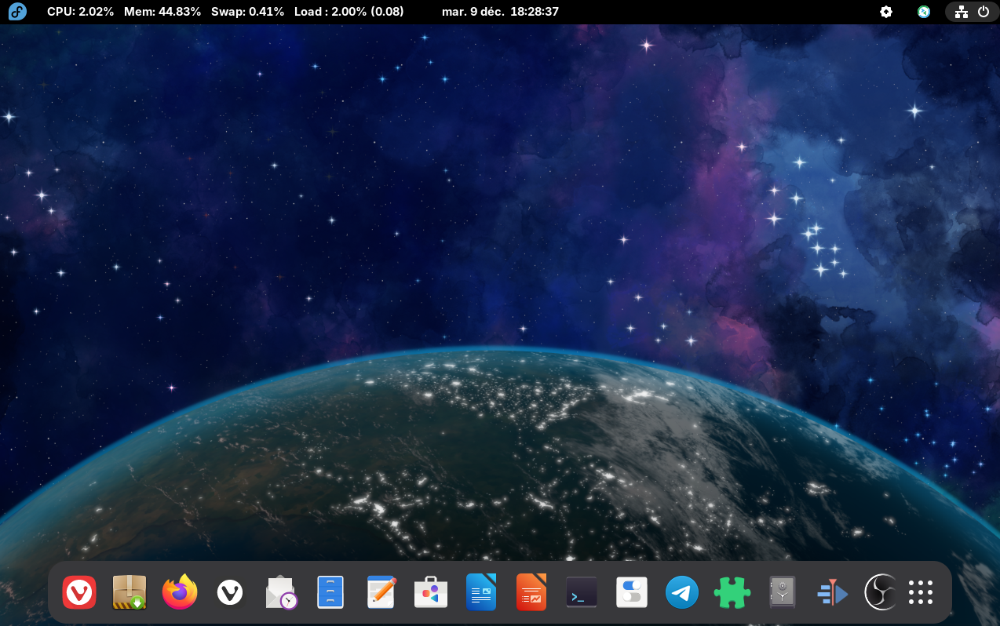
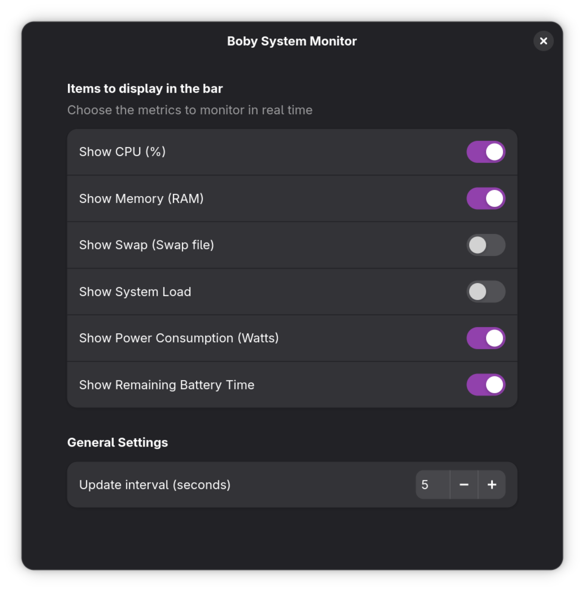

# System Monitor Tray Indicator for GNOME Shell

## Overview
This is a minimalist system monitor extension for GNOME Shell. It displays CPU, RAM, Swap usage and loadaverage left in your GNOME Shell top bar. 



## Features

- CPU usage
- RAM usage
- Swap usage
- Load average
- Battery status
- Parameters




## Compatibility

Known supported versions of GNOME:
- 49

It may be compatible with older versions, but no tests have been conducted to confirm this.

## Installation

Install via downloading this repository. 

```bash
cd /tmp
git clone https://github.com/GaspardBBY/boby-monitor-indicator.git
cd boby-monitor-indicator
./install.sh
```
Once done, manually restart the GNOME Shell for the changes to take effect. On **X** you can do this by pressing 
`Alt+F2`, typing `r`, and pressing `Enter`. On **Wayland**, simply log out and back in.

The `install.sh` script copies the extension files to your local GNOME extensions directory. Once GNOME restarts, you can manage extension via Extensions app.

## License

This project is licensed under the MIT License. See the [LICENSE](LICENSE) file for details.
